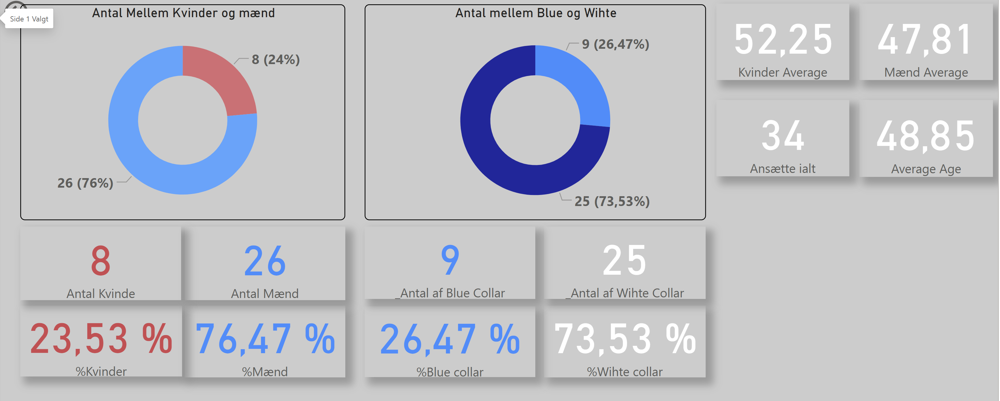
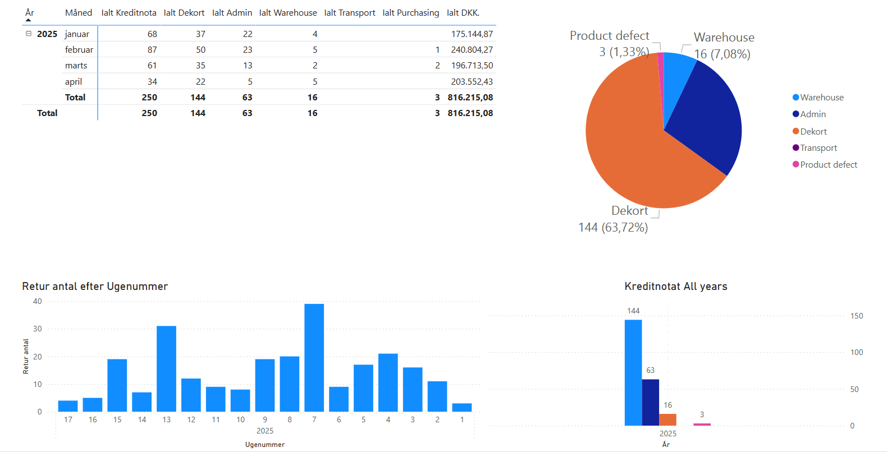

# 📂 Portfolio of Previous Work

This repository contains images of previous projects – **without any client information, company data, or task descriptions**.  
The purpose is to showcase visual examples of my skills and work methods.

---

## 📁 Structure

All images are located in the root of this repository:
- `Analyse_of_Company_employee.png`
- `Kreditnote_by_Error_2025.png`
- `Kreditnote_by_Error_Allyear.png`

---

## 🔒 Privacy and Confidentiality

All images are anonymized and contain **no sensitive data or references to clients or companies**.

---

## 🛠 Focus Areas

- Visual documentation of tasks
- Examples of analysis and reporting work
- Demonstration of quality and attention to detail

---

## 📌 Note

This repository is solely for **demonstrating skills** and **work methods**.

---

## 📷 Image Preview

Below are previews of the included images:

  
*Employee Age Analysis for HR Audit*

  
*Credit Note Report – Current Year*

  
*Credit Note Report – All Years*

---

### 💡 Tips for Better Presentation

- Use descriptive captions under each image for clarity.
- For multiple images in a grid layout, you can use HTML:
```html
<p align="center">
  
  
  
</p>
